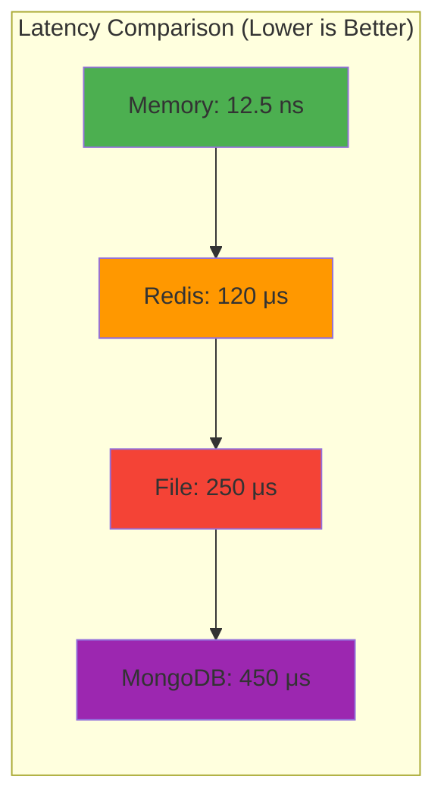
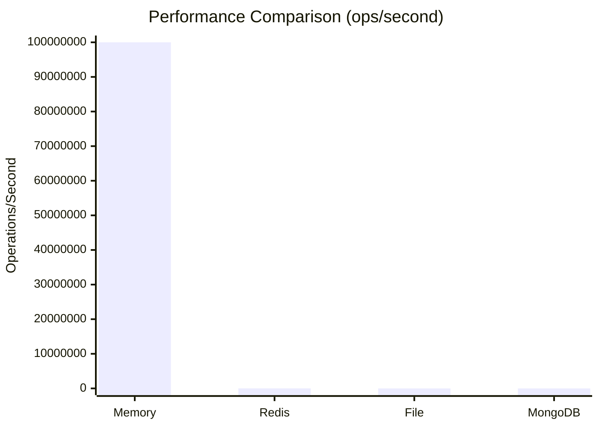

# Cache Drivers

Cache Drivers là các thành phần thực thi cụ thể cho từng loại storage backend trong hệ thống cache. Mỗi driver cài đặt interface `Driver` và cung cấp các tính năng tối ưu cho loại lưu trữ tương ứng.

## Mục lục

- [Khái niệm](#khái-niệm)
- [Driver Interface](#driver-interface)
- [Memory Driver](#memory-driver)
- [File Driver](#file-driver)
- [Redis Driver](#redis-driver)
- [MongoDB Driver](#mongodb-driver)
- [So sánh các Driver](#so-sánh-các-driver)
- [Hướng dẫn lựa chọn](#hướng-dẫn-lựa-chọn)
- [Custom Driver](#custom-driver)

## Khái niệm

Cache Drivers cung cấp layer abstraction giữa business logic và storage mechanism. Mỗi driver được thiết kế để tối ưu hóa cho đặc thính riêng của backend storage:

- **Memory Driver**: Tốc độ cao, dữ liệu tạm thời
- **File Driver**: Persistence đơn giản, không cần external dependencies
- **Redis Driver**: High performance, distributed caching
- **MongoDB Driver**: Complex data structures, rich querying

## Driver Interface

Tất cả driver phải implement interface `Driver`:

```go
type Driver interface {
    // Core operations
    Get(ctx context.Context, key string) (interface{}, bool)
    Set(ctx context.Context, key string, value interface{}, ttl time.Duration) error
    Has(ctx context.Context, key string) bool
    Delete(ctx context.Context, key string) error
    Flush(ctx context.Context) error
    
    // Batch operations
    GetMultiple(ctx context.Context, keys []string) (map[string]interface{}, []string)
    SetMultiple(ctx context.Context, values map[string]interface{}, ttl time.Duration) error
    DeleteMultiple(ctx context.Context, keys []string) error
    
    // Advanced operations
    Remember(ctx context.Context, key string, ttl time.Duration, 
            callback func() (interface{}, error)) (interface{}, error)
    
    // Management
    Stats(ctx context.Context) map[string]interface{}
    Close() error
}
```

## Memory Driver

Memory Driver lưu trữ dữ liệu trực tiếp trong RAM của ứng dụng, cung cấp tốc độ truy cập nhanh nhất.

### Đặc điểm

- **Performance**: Tốc độ cao nhất (nanosecond access time)
- **Persistence**: Không có (dữ liệu mất khi restart)
- **Memory usage**: Sử dụng RAM của ứng dụng
- **Scalability**: Giới hạn bởi memory của single machine
- **Thread safety**: Có (sử dụng sync.RWMutex)

### Cấu hình

```go
type DriverMemoryConfig struct {
    Enabled         bool `yaml:"enabled"`
    DefaultTTL      int  `yaml:"default_ttl"`      // TTL mặc định (giây)
    CleanupInterval int  `yaml:"cleanup_interval"` // Khoảng thời gian cleanup (giây)
    MaxItems        int  `yaml:"max_items"`        // Số item tối đa (0 = unlimited)
}
```

### Sử dụng

```go
// Tạo config
config := &config.DriverMemoryConfig{
    Enabled:         true,
    DefaultTTL:      3600,        // 1 hour
    CleanupInterval: 600,         // 10 minutes
    MaxItems:        10000,       // 10k items max
}

// Tạo driver
driver := memory.NewMemoryDriver(config)

// Sử dụng
ctx := context.Background()
driver.Set(ctx, "key", "value", time.Hour)
value, found := driver.Get(ctx, "key")
```

### Tính năng đặc biệt

#### 1. Automatic Cleanup
```go
// Memory driver tự động dọn dẹp expired items
// theo CleanupInterval được cấu hình
func (d *MemoryDriver) startCleanup() {
    ticker := time.NewTicker(d.cleanupInterval)
    go func() {
        for range ticker.C {
            d.cleanupExpired()
        }
    }()
}
```

#### 2. Memory Limit
```go
// Kiểm tra giới hạn trước khi thêm item mới
func (d *MemoryDriver) Set(ctx context.Context, key string, value interface{}, ttl time.Duration) error {
    if d.maxItems > 0 && len(d.items) >= d.maxItems {
        return ErrMemoryLimitExceeded
    }
    // ... set logic
}
```

#### 3. Statistics
```go
stats := driver.Stats(ctx)
// Output:
// {
//   "items": 1500,
//   "memory_usage": "15.2MB", 
//   "hits": 45000,
//   "misses": 3000,
//   "hit_ratio": 0.9375
// }
```

### Ví dụ chi tiết

```go
package main

import (
    "context"
    "fmt"
    "time"
    
    "go.fork.vn/cache/config"
    "go.fork.vn/cache/driver/memory"
)

func memoryDriverExample() {
    // Setup
    config := &config.DriverMemoryConfig{
        DefaultTTL:      1800,  // 30 minutes
        CleanupInterval: 300,   // 5 minutes
        MaxItems:        5000,  // 5k items
    }
    
    driver := memory.NewMemoryDriver(config)
    defer driver.Close()
    
    ctx := context.Background()
    
    // Basic operations
    driver.Set(ctx, "user:123", map[string]interface{}{
        "id":   123,
        "name": "John Doe",
    }, time.Hour)
    
    if user, found := driver.Get(ctx, "user:123"); found {
        fmt.Printf("User: %+v\n", user)
    }
    
    // Batch operations
    users := map[string]interface{}{
        "user:1": map[string]interface{}{"id": 1, "name": "Alice"},
        "user:2": map[string]interface{}{"id": 2, "name": "Bob"},
        "user:3": map[string]interface{}{"id": 3, "name": "Charlie"},
    }
    
    driver.SetMultiple(ctx, users, time.Hour)
    
    found, missed := driver.GetMultiple(ctx, []string{"user:1", "user:2", "user:4"})
    fmt.Printf("Found: %+v\n", found)
    fmt.Printf("Missed: %+v\n", missed)
    
    // Statistics
    stats := driver.Stats(ctx)
    fmt.Printf("Stats: %+v\n", stats)
}
```

## File Driver

File Driver lưu trữ cache data dưới dạng files trên hệ thống file local, cung cấp persistence đơn giản.

### Đặc điểm

- **Performance**: Trung bình (phụ thuộc vào disk I/O)
- **Persistence**: Có (dữ liệu được lưu trên disk)
- **Dependencies**: Không cần external services
- **Scalability**: Giới hạn bởi disk space và I/O performance
- **Thread safety**: Có (sử dụng file locking)

### Cấu hình

```go
type DriverFileConfig struct {
    Enabled         bool   `yaml:"enabled"`
    Path            string `yaml:"path"`             // Thư mục lưu cache files
    DefaultTTL      int    `yaml:"default_ttl"`      // TTL mặc định (giây)  
    Extension       string `yaml:"extension"`        // Extension cho cache files
    CleanupInterval int    `yaml:"cleanup_interval"` // Khoảng thời gian cleanup (giây)
}
```

### Sử dụng

```go
// Tạo config
config := &config.DriverFileConfig{
    Enabled:         true,
    Path:            "./storage/cache",  // Cache directory
    DefaultTTL:      3600,               // 1 hour
    Extension:       ".cache",           // File extension
    CleanupInterval: 600,                // 10 minutes
}

// Tạo driver
driver := file.NewFileDriver(config)

// Sử dụng
ctx := context.Background()
driver.Set(ctx, "user:123", userData, time.Hour)
```

### File Structure

```
storage/cache/
├── user_123.cache              # Single key
├── config_app.cache           # App config
├── session_abc123.cache       # User session
└── lookup_countries.cache     # Country data
```

### Serialization

File driver sử dụng GOB encoding để serialize data:

```go
type CacheItem struct {
    Value     interface{} `gob:"value"`
    ExpiresAt time.Time   `gob:"expires_at"`
    CreatedAt time.Time   `gob:"created_at"`
}
```

### Tính năng đặc biệt

#### 1. File Locking
```go
// File driver sử dụng exclusive locking để đảm bảo thread safety
func (d *FileDriver) writeToFile(filename string, item *CacheItem) error {
    file, err := os.OpenFile(filename, os.O_CREATE|os.O_WRONLY|os.O_TRUNC, 0644)
    if err != nil {
        return err
    }
    defer file.Close()
    
    // Lock file for exclusive access
    if err := syscall.Flock(int(file.Fd()), syscall.LOCK_EX); err != nil {
        return err
    }
    defer syscall.Flock(int(file.Fd()), syscall.LOCK_UN)
    
    encoder := gob.NewEncoder(file)
    return encoder.Encode(item)
}
```

#### 2. Cleanup Expired Files
```go
// Tự động xóa các file expired
func (d *FileDriver) cleanupExpired() {
    filepath.Walk(d.cachePath, func(path string, info os.FileInfo, err error) error {
        if err != nil || info.IsDir() {
            return nil
        }
        
        if d.isFileExpired(path) {
            os.Remove(path)
        }
        return nil
    })
}
```

### Ví dụ chi tiết

```go
func fileDriverExample() {
    // Setup
    config := &config.DriverFileConfig{
        Path:            "./tmp/cache",
        DefaultTTL:      3600,
        Extension:       ".cache",
        CleanupInterval: 300,
    }
    
    driver := file.NewFileDriver(config)
    defer driver.Close()
    
    ctx := context.Background()
    
    // Cache complex data
    productData := map[string]interface{}{
        "id":          12345,
        "name":        "MacBook Pro",
        "price":       1999.99,
        "category":    "Electronics",
        "attributes": []string{"laptop", "apple", "professional"},
        "created_at": time.Now(),
    }
    
    // Set with custom TTL
    err := driver.Set(ctx, "product:12345", productData, 2*time.Hour)
    if err != nil {
        log.Printf("Failed to cache product: %v", err)
        return
    }
    
    // Get data
    if cached, found := driver.Get(ctx, "product:12345"); found {
        product := cached.(map[string]interface{})
        fmt.Printf("Cached product: %s - $%.2f\n", 
                   product["name"], product["price"])
    }
    
    // Check persistence (data survives restart)
    fmt.Printf("Cache persisted: %t\n", driver.Has(ctx, "product:12345"))
}
```

## Redis Driver

Redis Driver sử dụng Redis server để lưu trữ cache, cung cấp performance cao và khả năng scale horizontal.

### Đặc điểm

- **Performance**: Rất cao (sub-millisecond access time)
- **Persistence**: Có (Redis RDB/AOF)
- **Scalability**: Cao (Redis Cluster support)
- **Features**: Rich data types, pub/sub, transactions
- **Network**: Distributed caching across multiple apps

### Cấu hình

```go
type DriverRedisConfig struct {
    Enabled    bool   `yaml:"enabled"`
    DefaultTTL int    `yaml:"default_ttl"` // TTL mặc định (giây)
    Serializer string `yaml:"serializer"`  // json, gob, msgpack
}
```

### Sử dụng

```go
// Tạo config
config := &config.DriverRedisConfig{
    Enabled:    true,
    DefaultTTL: 3600,     // 1 hour  
    Serializer: "json",   // JSON serialization
}

// Tạo driver
driver := redis.NewRedisDriver(config)

// Sử dụng
ctx := context.Background()
driver.Set(ctx, "session:abc123", sessionData, time.Hour)
```

### Serialization Options

#### 1. JSON Serializer (Default)
```go
// Human readable, cross-language compatible
config.Serializer = "json"

// Data được lưu dưới dạng JSON string trong Redis
// "user:123" -> `{"id":123,"name":"John","email":"john@example.com"}`
```

#### 2. GOB Serializer
```go
// Go-specific, more efficient for Go types
config.Serializer = "gob"

// Binary format, smaller size, faster but Go-only
```

#### 3. MessagePack Serializer
```go
// Binary format, cross-language, compact
config.Serializer = "msgpack"

// Compact binary format, good performance
```

### Tính năng đặc biệt

#### 1. Connection Pooling
```go
// Redis driver sử dụng connection pool để tối ưu performance
type RedisDriver struct {
    client     *redis.Client
    serializer Serializer
    defaultTTL time.Duration
}

func NewRedisDriver(config *config.DriverRedisConfig) *RedisDriver {
    client := redis.NewClient(&redis.Options{
        Addr:         "localhost:6379",
        PoolSize:     10,              // Connection pool size
        MinIdleConns: 5,               // Minimum idle connections
        MaxRetries:   3,               // Max retry attempts
        DialTimeout:  5 * time.Second, // Connection timeout
    })
    
    return &RedisDriver{client: client}
}
```

#### 2. Pipeline Support
```go
// Batch operations sử dụng Redis pipeline
func (d *RedisDriver) SetMultiple(ctx context.Context, values map[string]interface{}, ttl time.Duration) error {
    pipe := d.client.Pipeline()
    
    for key, value := range values {
        serialized, err := d.serializer.Serialize(value)
        if err != nil {
            return err
        }
        pipe.Set(ctx, key, serialized, ttl)
    }
    
    _, err := pipe.Exec(ctx)
    return err
}
```

#### 3. Advanced Statistics
```go
stats := driver.Stats(ctx)
// Output:
// {
//   "redis_version": "7.0.0",
//   "connected_clients": 5,
//   "used_memory": "2.1MB",
//   "keyspace_hits": 15000,
//   "keyspace_misses": 500,
//   "total_commands_processed": 25000
// }
```

### Ví dụ chi tiết

```go
func redisDriverExample() {
    config := &config.DriverRedisConfig{
        DefaultTTL: 1800,      // 30 minutes
        Serializer: "json",    // JSON format
    }
    
    driver := redis.NewRedisDriver(config)
    defer driver.Close()
    
    ctx := context.Background()
    
    // Cache user session
    session := map[string]interface{}{
        "user_id":    123,
        "username":   "john_doe", 
        "roles":      []string{"user", "premium"},
        "login_time": time.Now(),
        "ip_address": "192.168.1.100",
    }
    
    sessionKey := "session:abc123def456"
    err := driver.Set(ctx, sessionKey, session, 30*time.Minute)
    if err != nil {
        log.Printf("Failed to cache session: %v", err)
        return
    }
    
    // Get session
    if cached, found := driver.Get(ctx, sessionKey); found {
        userSession := cached.(map[string]interface{})
        fmt.Printf("User %s logged in from %s\n", 
                   userSession["username"], userSession["ip_address"])
    }
    
    // Use Remember pattern for expensive operations
    userProfile, err := driver.Remember(ctx, "profile:123", time.Hour, func() (interface{}, error) {
        // Simulate expensive API call
        time.Sleep(200 * time.Millisecond)
        return fetchUserProfileFromAPI(123)
    })
    
    if err != nil {
        log.Printf("Failed to get user profile: %v", err)
        return
    }
    
    fmt.Printf("User profile: %+v\n", userProfile)
}
```

## MongoDB Driver

MongoDB Driver sử dụng MongoDB collection để lưu trữ cache, phù hợp cho complex data và rich querying.

### Đặc điểm

- **Performance**: Tốt (millisecond access time)
- **Persistence**: Có (MongoDB durability)
- **Scalability**: Rất cao (MongoDB sharding)
- **Query capability**: Rich querying, indexing
- **Data types**: Support complex nested documents

### Cấu hình

```go
type DriverMongodbConfig struct {
    Enabled    bool   `yaml:"enabled"`
    Database   string `yaml:"database"`   // Database name
    Collection string `yaml:"collection"` // Collection name  
    DefaultTTL int    `yaml:"default_ttl"` // TTL mặc định (giây)
    Hits       int64  `yaml:"hits"`       // Cache hits (readonly)
    Misses     int64  `yaml:"misses"`     // Cache misses (readonly)
}
```

### Document Structure

```go
type CacheDocument struct {
    ID        string      `bson:"_id"`         // Cache key
    Value     interface{} `bson:"value"`       // Cached value
    ExpiresAt time.Time   `bson:"expires_at"`  // Expiration time
    CreatedAt time.Time   `bson:"created_at"`  // Creation time
    UpdatedAt time.Time   `bson:"updated_at"`  // Last update time
    TTL       int64       `bson:"ttl"`         // TTL in seconds
}
```

### Sử dụng

```go
// Tạo config
config := &config.DriverMongodbConfig{
    Enabled:    true,
    Database:   "cache_db",
    Collection: "cache_items",
    DefaultTTL: 3600,
}

// Tạo driver (cần MongoDB connection)
driver := mongodb.NewMongodbDriver(config, mongoClient)

// Sử dụng
ctx := context.Background()
driver.Set(ctx, "analytics:daily", analyticsData, 24*time.Hour)
```

### Tính năng đặc biệt

#### 1. TTL Index
```go
// MongoDB driver tự động tạo TTL index cho automatic cleanup
func (d *MongodbDriver) ensureIndexes() error {
    indexModel := mongo.IndexModel{
        Keys: bson.D{{"expires_at", 1}},
        Options: options.Index().SetExpireAfterSeconds(0),
    }
    
    _, err := d.collection.Indexes().CreateOne(context.Background(), indexModel)
    return err
}
```

#### 2. Atomic Operations
```go
// Sử dụng MongoDB upsert cho atomic set operations
func (d *MongodbDriver) Set(ctx context.Context, key string, value interface{}, ttl time.Duration) error {
    doc := CacheDocument{
        ID:        key,
        Value:     value,
        ExpiresAt: time.Now().Add(ttl),
        UpdatedAt: time.Now(),
        TTL:       int64(ttl.Seconds()),
    }
    
    filter := bson.M{"_id": key}
    update := bson.M{"$set": doc, "$setOnInsert": bson.M{"created_at": time.Now()}}
    
    opts := options.Update().SetUpsert(true)
    _, err := d.collection.UpdateOne(ctx, filter, update, opts)
    return err
}
```

#### 3. Aggregation Pipeline Support
```go
// MongoDB driver có thể sử dụng aggregation pipeline cho complex queries
func (d *MongodbDriver) GetByPattern(ctx context.Context, pattern string) (map[string]interface{}, error) {
    pipeline := bson.A{
        bson.M{"$match": bson.M{
            "_id": bson.M{"$regex": pattern},
            "expires_at": bson.M{"$gt": time.Now()},
        }},
        bson.M{"$project": bson.M{
            "key": "$_id",
            "value": 1,
            "created_at": 1,
        }},
    }
    
    cursor, err := d.collection.Aggregate(ctx, pipeline)
    if err != nil {
        return nil, err
    }
    defer cursor.Close(ctx)
    
    results := make(map[string]interface{})
    for cursor.Next(ctx) {
        var doc struct {
            Key   string      `bson:"key"`
            Value interface{} `bson:"value"`
        }
        if err := cursor.Decode(&doc); err != nil {
            continue
        }
        results[doc.Key] = doc.Value
    }
    
    return results, nil
}
```

### Ví dụ chi tiết

```go
func mongodbDriverExample() {
    // MongoDB connection
    client, err := mongo.Connect(context.Background(), options.Client().ApplyURI("mongodb://localhost:27017"))
    if err != nil {
        log.Fatal(err)
    }
    defer client.Disconnect(context.Background())
    
    // Setup driver
    config := &config.DriverMongodbConfig{
        Database:   "cache_db",
        Collection: "cache_items", 
        DefaultTTL: 3600,
    }
    
    driver := mongodb.NewMongodbDriver(config, client)
    defer driver.Close()
    
    ctx := context.Background()
    
    // Cache complex analytics data
    analyticsData := map[string]interface{}{
        "date": time.Now().Format("2006-01-02"),
        "metrics": map[string]interface{}{
            "page_views":      15000,
            "unique_visitors": 8500,
            "bounce_rate":     0.35,
            "avg_session":     "4m 32s",
        },
        "top_pages": []map[string]interface{}{
            {"path": "/home", "views": 5000},
            {"path": "/products", "views": 3200},
            {"path": "/about", "views": 1800},
        },
        "geographic_data": map[string]interface{}{
            "US": 45.2,
            "UK": 18.7,
            "CA": 12.1,
            "DE": 8.9,
        },
    }
    
    // Cache for 24 hours
    key := fmt.Sprintf("analytics:daily:%s", time.Now().Format("2006-01-02"))
    err = driver.Set(ctx, key, analyticsData, 24*time.Hour)
    if err != nil {
        log.Printf("Failed to cache analytics: %v", err)
        return
    }
    
    // Retrieve and process
    if cached, found := driver.Get(ctx, key); found {
        analytics := cached.(map[string]interface{})
        metrics := analytics["metrics"].(map[string]interface{})
        
        fmt.Printf("Daily Analytics for %s:\n", analytics["date"])
        fmt.Printf("- Page Views: %.0f\n", metrics["page_views"])
        fmt.Printf("- Unique Visitors: %.0f\n", metrics["unique_visitors"])
        fmt.Printf("- Bounce Rate: %.1f%%\n", metrics["bounce_rate"].(float64)*100)
    }
    
    // Statistics with MongoDB-specific metrics
    stats := driver.Stats(ctx)
    fmt.Printf("MongoDB Cache Stats: %+v\n", stats)
}
```

## So sánh các Driver

| Đặc điểm | Memory | File | Redis | MongoDB |
|----------|---------|------|-------|---------|
| **Performance** | Rất cao (ns) | Trung bình (ms) | Cao (sub-ms) | Tốt (ms) |
| **Persistence** | Không | Có | Có | Có |
| **Scalability** | Thấp | Thấp | Cao | Rất cao |
| **Dependencies** | Không | Không | Redis Server | MongoDB |
| **Memory Usage** | Cao | Thấp | Thấp | Thấp |
| **Data Types** | Go types | Serialized | Strings + Types | Rich Documents |
| **Query Capability** | Không | Không | Cơ bản | Rich Querying |
| **Network Overhead** | Không | Không | Có | Có |
| **Setup Complexity** | Đơn giản | Đơn giản | Trung bình | Trung bình |

### Performance Benchmarks





## Hướng dẫn lựa chọn

### Memory Driver - Khi nào sử dụng?

✅ **Phù hợp:**
- Ứng dụng single instance
- Data không cần persist qua restart
- Performance là ưu tiên hàng đầu
- Cache size nhỏ (< RAM available)
- Development và testing

❌ **Không phù hợp:**
- Ứng dụng multi-instance
- Data quan trọng cần persist
- Memory-constrained environments
- Large datasets

**Ví dụ use cases:**
```go
// Session storage cho single-server app
// Lookup tables (countries, currencies)
// Computed results với lifetime ngắn
// Development cache
```

### File Driver - Khi nào sử dụng?

✅ **Phù hợp:**
- Cần persistence đơn giản
- Không muốn external dependencies
- Single instance applications
- Moderate performance requirements

❌ **Không phù hợp:**
- High-performance requirements
- Multi-instance applications  
- Frequent writes (disk I/O bottleneck)
- Network file systems

**Ví dụ use cases:**
```go
// Configuration cache
// Compiled templates
// Static content cache
// Desktop applications
```

### Redis Driver - Khi nào sử dụng?

✅ **Phù hợp:**
- Multi-instance applications
- High performance requirements
- Need to share cache across services
- Complex data operations
- Production environments

❌ **Không phù hợp:**
- Simple single-instance apps
- Avoid external dependencies
- Cost-sensitive environments
- Very simple caching needs

**Ví dụ use cases:**
```go
// Session storage cho web apps
// API response caching
// Rate limiting counters
// Real-time leaderboards
// Distributed locking
```

### MongoDB Driver - Khi nào sử dụng?

✅ **Phù hợp:**
- Complex data structures
- Need rich querying capability
- Analytics và reporting cache
- Document-based applications
- Already using MongoDB

❌ **Không phù hợp:**
- Simple key-value caching
- High-frequency operations
- Memory-only requirements
- Minimal setup needs

**Ví dụ use cases:**
```go
// Analytics data cache
// Complex user profiles
// Product catalogs
// Search results with metadata
// Audit trails
```

## Custom Driver

Bạn có thể tạo custom driver bằng cách implement interface `Driver`:

```go
package custom

import (
    "context"
    "time"
    
    "go.fork.vn/cache/driver"
)

type CustomDriver struct {
    // Your custom fields
}

func NewCustomDriver(config interface{}) *CustomDriver {
    return &CustomDriver{
        // Initialize your driver
    }
}

func (d *CustomDriver) Get(ctx context.Context, key string) (interface{}, bool) {
    // Your implementation
    return nil, false
}

func (d *CustomDriver) Set(ctx context.Context, key string, value interface{}, ttl time.Duration) error {
    // Your implementation
    return nil
}

// Implement all other required methods...
```

### Ví dụ DynamoDB Driver

```go
type DynamoDBDriver struct {
    client    *dynamodb.Client
    tableName string
    region    string
}

func NewDynamoDBDriver(tableName, region string) *DynamoDBDriver {
    cfg, _ := config.LoadDefaultConfig(context.TODO(), config.WithRegion(region))
    client := dynamodb.NewFromConfig(cfg)
    
    return &DynamoDBDriver{
        client:    client,
        tableName: tableName,
        region:    region,
    }
}

func (d *DynamoDBDriver) Get(ctx context.Context, key string) (interface{}, bool) {
    input := &dynamodb.GetItemInput{
        TableName: aws.String(d.tableName),
        Key: map[string]types.AttributeValue{
            "cache_key": &types.AttributeValueMemberS{Value: key},
        },
    }
    
    result, err := d.client.GetItem(ctx, input)
    if err != nil || result.Item == nil {
        return nil, false
    }
    
    // Check expiration
    if expiresAt, ok := result.Item["expires_at"]; ok {
        if exp, err := time.Parse(time.RFC3339, expiresAt.(*types.AttributeValueMemberS).Value); err == nil {
            if time.Now().After(exp) {
                return nil, false
            }
        }
    }
    
    // Deserialize value
    if valueAttr, ok := result.Item["value"]; ok {
        return deserializeValue(valueAttr), true
    }
    
    return nil, false
}

func (d *DynamoDBDriver) Set(ctx context.Context, key string, value interface{}, ttl time.Duration) error {
    serializedValue := serializeValue(value)
    expiresAt := time.Now().Add(ttl)
    
    input := &dynamodb.PutItemInput{
        TableName: aws.String(d.tableName),
        Item: map[string]types.AttributeValue{
            "cache_key": &types.AttributeValueMemberS{Value: key},
            "value":     serializedValue,
            "expires_at": &types.AttributeValueMemberS{Value: expiresAt.Format(time.RFC3339)},
            "created_at": &types.AttributeValueMemberS{Value: time.Now().Format(time.RFC3339)},
        },
    }
    
    _, err := d.client.PutItem(ctx, input)
    return err
}

// Implement other required methods...
```

Cache Drivers cung cấp flexibility cao cho việc lưu trữ cache data, mỗi driver được tối ưu cho use case cụ thể. Việc lựa chọn driver phù hợp sẽ ảnh hưởng trực tiếp đến performance và reliability của ứng dụng.
