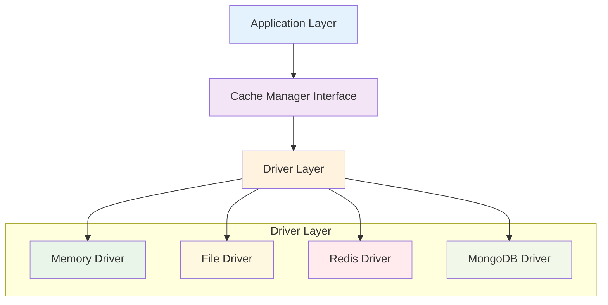

# Tài Liệu Cache Module

## Tổng Quan

Cache Module (`go.fork.vn/cache`) là một thư viện cache hiệu suất cao được thiết kế cho ứng dụng Go, cung cấp các giải pháp lưu trữ cache linh hoạt và mở rộng. Module này hỗ trợ nhiều loại driver cache khác nhau từ bộ nhớ trong hệ thống đến các hệ thống lưu trữ phân tán như Redis và MongoDB.

## Tính Năng Chính

### 🚀 **Hiệu Suất Cao**
- Thread-safe operations với goroutines
- Batch operations để tối ưu hóa throughput
- Automatic cleanup cho expired entries
- Zero-allocation trong hot paths

### 🔧 **Đa Dạng Driver**
- **Memory Driver**: Cache trong bộ nhớ với tốc độ truy cập cực nhanh
- **File Driver**: Persistent cache sử dụng filesystem
- **Redis Driver**: Distributed cache với Redis backend
- **MongoDB Driver**: Document-based cache với MongoDB

### ⚙️ **Cấu Hình Linh Hoạt**
- YAML/JSON configuration support
- Environment-specific configurations
- Runtime configuration updates
- Driver-specific tuning parameters

### 🔄 **Tích Hợp DI (Dependency Injection)**
- Native support cho DI containers
- Service provider pattern
- Automatic dependency resolution
- Lifecycle management

## Kiến Trúc Hệ Thống



## Cấu Trúc Thư Mục

```
cache/
├── config/          # Configuration structures
├── driver/          # Driver implementations
│   ├── memory.go    # Memory cache driver
│   ├── file.go      # File system cache driver
│   ├── redis.go     # Redis cache driver
│   └── mongodb.go   # MongoDB cache driver
├── docs/            # Documentation
├── mocks/           # Mock objects for testing
└── configs/         # Sample configuration files
```

## Quick Start

### Cài Đặt

```bash
go get go.fork.vn/cache
```

### Sử Dụng Cơ Bản

```go
import (
    "go.fork.vn/cache"
    "go.fork.vn/cache/driver"
    "go.fork.vn/cache/config"
)

// Khởi tạo memory driver
memoryConfig := config.DriverMemoryConfig{
    Enabled:         true,
    DefaultTTL:      3600,
    CleanupInterval: 600,
    MaxItems:        10000,
}

memoryDriver := driver.NewMemoryDriver(memoryConfig)

// Tạo cache manager
manager := cache.NewManager()
manager.AddDriver("memory", memoryDriver)
manager.SetDefaultDriver("memory")

// Sử dụng cache
manager.Set("user:123", userData, 5*time.Minute)
data, found := manager.Get("user:123")
```

## Tài Liệu Chi Tiết

### 📚 **Hướng Dẫn Cấu Hình**
- [Overview](overview.md) - Tổng quan về cache module
- [Configuration](config.md) - Chi tiết về cấu hình hệ thống
- [Provider](provider.md) - Service provider và dependency injection

### 🔧 **Driver Documentation**
- [Driver Interface](driver.md) - Interface và implementation details
- [Manager](manager.md) - Cache manager và operations

### 📖 **Advanced Topics**
- [Best Practices](best-practices.md) - Các thực hành tốt nhất
- [Performance Tuning](performance.md) - Tối ưu hóa hiệu suất
- [Monitoring](monitoring.md) - Giám sát và metrics

## Ví Dụ Sử Dụng

### Remember Pattern

```go
// Lazy loading với automatic caching
userData, err := manager.Remember("user:123", 1*time.Hour, func() (interface{}, error) {
    return fetchUserFromDatabase(123)
})
```

### Batch Operations

```go
// Set multiple values
values := map[string]interface{}{
    "user:1": user1,
    "user:2": user2,
    "user:3": user3,
}
manager.SetMultiple(values, 1*time.Hour)

// Get multiple values
keys := []string{"user:1", "user:2", "user:3"}
results, missed := manager.GetMultiple(keys)
```

### Statistics & Monitoring

```go
// Lấy thống kê cache
stats := manager.Stats()
fmt.Printf("Hits: %d, Misses: %d, Hit Rate: %.2f%%\n", 
    stats["hits"], stats["misses"], stats["hit_rate"])
```

## Compatibility

- **Go Version**: 1.21+
- **Redis**: 6.0+
- **MongoDB**: 4.4+

## Support

### Dependencies
- `go.fork.vn/di` - Dependency injection framework
- `go.fork.vn/config` - Configuration management
- `go.fork.vn/redis` - Redis integration
- `go.fork.vn/mongodb` - MongoDB integration

### External Dependencies
- `github.com/go-redis/redis/v8` - Redis client
- `go.mongodb.org/mongo-driver` - MongoDB driver
- `github.com/vmihailenco/msgpack/v5` - MessagePack serialization

## Phiên Bản

**Current Version**: v0.1.0

Xem [CHANGELOG.md](../CHANGELOG.md) để biết chi tiết về các phiên bản và thay đổi.

## License

Dự án này được phát hành dưới [MIT License](../LICENSE).
