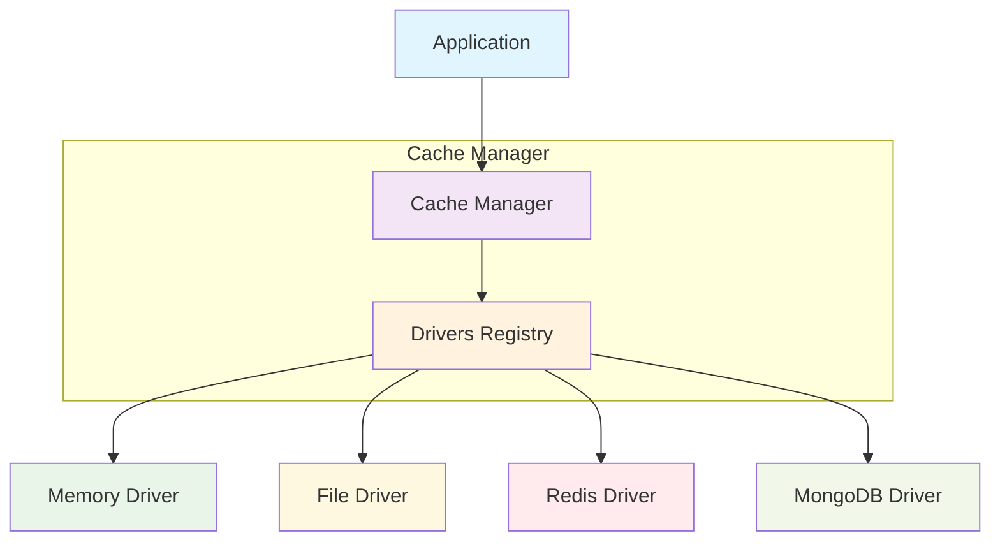
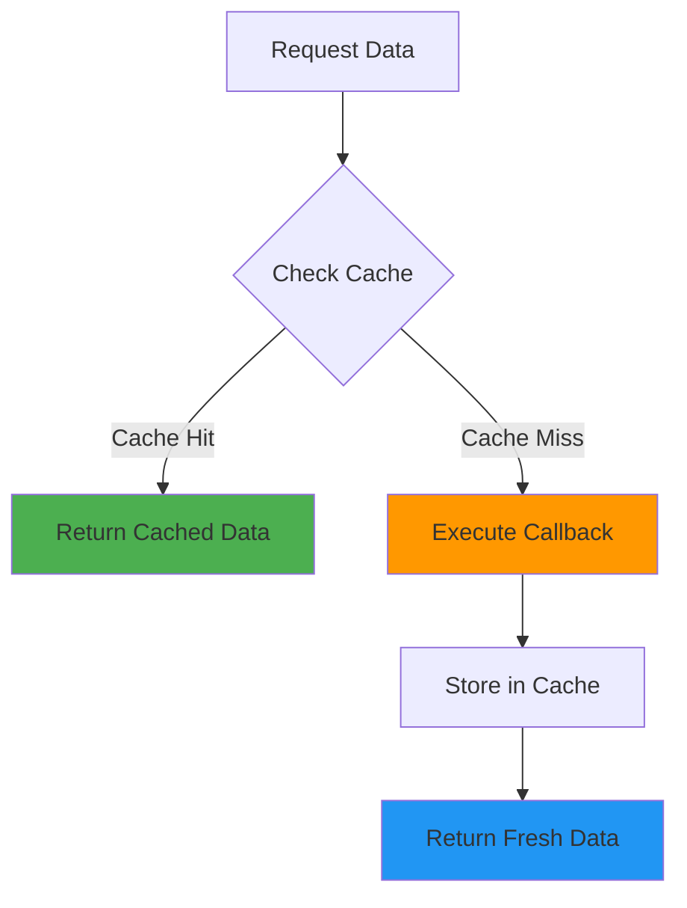

# Cache Manager

Cache Manager là thành phần trung tâm của hệ thống cache, quản lý và điều phối các driver khác nhau thông qua một interface thống nhất. Manager cung cấp một lớp trừu tượng cao cấp cho phép ứng dụng thực hiện các thao tác cache mà không cần biết chi tiết về driver cụ thể đang được sử dụng.

## Mục lục

- [Khái niệm](#khái-niệm)
- [Kiến trúc](#kiến-trúc)
- [Interface Manager](#interface-manager)
- [Các thao tác cơ bản](#các-thao-tác-cơ-bản)
- [Quản lý Driver](#quản-lý-driver)
- [Thao tác nâng cao](#thao-tác-nâng-cao)
- [Xử lý lỗi](#xử-lý-lỗi)
- [Thread Safety](#thread-safety)
- [Ví dụ sử dụng](#ví-dụ-sử-dụng)

## Khái niệm

Cache Manager hoạt động như một **facade pattern**, cung cấp một interface đơn giản và thống nhất để tương tác với nhiều driver cache khác nhau. Nó cho phép:

- **Multi-driver support**: Quản lý nhiều driver cùng lúc
- **Dynamic switching**: Chuyển đổi driver mặc định trong runtime
- **Unified API**: Cung cấp API thống nhất cho tất cả driver
- **Resource management**: Quản lý tài nguyên và lifecycle của driver

## Kiến trúc



## Interface Manager

Manager interface định nghĩa các phương thức cần thiết để quản lý cache:

### Phương thức cơ bản

```go
type Manager interface {
    // Thao tác cache cơ bản
    Get(key string) (interface{}, bool)
    Set(key string, value interface{}, ttl time.Duration) error
    Has(key string) bool
    Delete(key string) error
    Flush() error
    
    // Thao tác batch
    GetMultiple(keys []string) (map[string]interface{}, []string)
    SetMultiple(values map[string]interface{}, ttl time.Duration) error
    DeleteMultiple(keys []string) error
    
    // Thao tác nâng cao
    Remember(key string, ttl time.Duration, callback func() (interface{}, error)) (interface{}, error)
    
    // Quản lý driver
    AddDriver(name string, driver driver.Driver)
    SetDefaultDriver(name string)
    Driver(name string) (driver.Driver, error)
    
    // Thống kê và quản lý
    Stats() map[string]map[string]interface{}
    Close() error
}
```

## Các thao tác cơ bản

### 1. Get - Lấy giá trị

```go
value, found := manager.Get("user:123")
if found {
    user := value.(User)
    fmt.Printf("Found user: %+v\n", user)
} else {
    fmt.Println("User not found in cache")
}
```

**Đặc điểm:**
- Trả về `(value, true)` nếu tìm thấy và chưa hết hạn
- Trả về `(nil, false)` nếu không tìm thấy hoặc đã hết hạn
- Sử dụng driver mặc định

### 2. Set - Lưu giá trị

```go
user := User{ID: 123, Name: "John Doe"}
err := manager.Set("user:123", user, 1*time.Hour)
if err != nil {
    log.Printf("Failed to cache user: %v", err)
}
```

**Tham số TTL:**
- `0`: Sử dụng TTL mặc định của driver
- `> 0`: TTL cụ thể
- `-1`: Không hết hạn (nếu driver hỗ trợ)

### 3. Has - Kiểm tra tồn tại

```go
if manager.Has("user:123") {
    fmt.Println("User exists in cache")
}
```

### 4. Delete - Xóa key

```go
err := manager.Delete("user:123")
if err != nil {
    log.Printf("Failed to delete user from cache: %v", err)
}
```

### 5. Flush - Xóa tất cả

```go
err := manager.Flush()
if err != nil {
    log.Printf("Failed to flush cache: %v", err)
}
```

## Quản lý Driver

### Thêm Driver

```go
// Tạo manager
manager := cache.NewManager()

// Thêm memory driver
memoryDriver := memory.NewMemoryDriver(&config.DriverMemoryConfig{
    DefaultTTL:      3600,
    CleanupInterval: 600,
    MaxItems:        10000,
})
manager.AddDriver("memory", memoryDriver)

// Thêm redis driver
redisDriver := redis.NewRedisDriver(&config.DriverRedisConfig{
    DefaultTTL: 3600,
    Serializer: "json",
})
manager.AddDriver("redis", redisDriver)
```

### Đặt Driver mặc định

```go
// Đặt redis làm driver mặc định
manager.SetDefaultDriver("redis")

// Tất cả thao tác sẽ sử dụng redis
manager.Set("key", "value", time.Hour)
```

### Truy cập Driver cụ thể

```go
// Sử dụng driver cụ thể
redisDriver, err := manager.Driver("redis")
if err != nil {
    log.Fatal(err)
}

// Thực hiện thao tác trực tiếp với driver
redisDriver.Set(context.Background(), "redis-key", "value", time.Hour)
```

## Thao tác nâng cao

### 1. Batch Operations

```go
// Get multiple
keys := []string{"user:1", "user:2", "user:3"}
values, missed := manager.GetMultiple(keys)

for key, value := range values {
    fmt.Printf("Found %s: %+v\n", key, value)
}

for _, key := range missed {
    fmt.Printf("Missed: %s\n", key)
}

// Set multiple
data := map[string]interface{}{
    "user:1": User{ID: 1, Name: "Alice"},
    "user:2": User{ID: 2, Name: "Bob"},
    "user:3": User{ID: 3, Name: "Charlie"},
}
err := manager.SetMultiple(data, time.Hour)

// Delete multiple
err = manager.DeleteMultiple([]string{"user:1", "user:2"})
```

### 2. Remember Pattern

Remember pattern là một mẫu thiết kế phổ biến trong cache, tự động lấy dữ liệu từ nguồn gốc nếu không có trong cache:



```go
user, err := manager.Remember("user:123", time.Hour, func() (interface{}, error) {
    // Callback được gọi khi cache miss
    return userService.GetByID(123)
})

if err != nil {
    log.Printf("Failed to get user: %v", err)
    return
}

// user luôn có giá trị (từ cache hoặc từ callback)
fmt.Printf("User: %+v\n", user.(User))
```

### 3. Thống kê

```go
stats := manager.Stats()
for driverName, driverStats := range stats {
    fmt.Printf("Driver %s stats:\n", driverName)
    for key, value := range driverStats {
        fmt.Printf("  %s: %v\n", key, value)
    }
}
```

## Xử lý lỗi

Manager xử lý các loại lỗi phổ biến:

### 1. Driver không tồn tại

```go
driver, err := manager.Driver("nonexistent")
if err != nil {
    // Error: cache driver 'nonexistent' not found
    log.Printf("Driver error: %v", err)
}
```

### 2. Không có driver mặc định

```go
manager := cache.NewManager()
// Chưa add driver nào

err := manager.Set("key", "value", time.Hour)
if err != nil {
    // Error: no default cache driver set
    log.Printf("No default driver: %v", err)
}
```

### 3. Driver mặc định bị xóa

```go
manager.AddDriver("memory", memoryDriver)
manager.SetDefaultDriver("memory")

// Sau đó driver bị xóa khỏi registry
delete(manager.drivers, "memory")

err := manager.Set("key", "value", time.Hour)
// Error: default cache driver 'memory' not found
```

## Thread Safety

Cache Manager được thiết kế để thread-safe:

```go
type manager struct {
    drivers       map[string]driver.Driver
    defaultDriver string
    mu            sync.RWMutex  // Bảo vệ concurrent access
}
```

### Các thao tác thread-safe

- **Read operations**: Sử dụng RLock cho hiệu suất cao
- **Write operations**: Sử dụng Lock cho data integrity
- **Driver registry**: Được bảo vệ bởi mutex

### Sử dụng concurrent

```go
var wg sync.WaitGroup

// Concurrent reads
for i := 0; i < 100; i++ {
    wg.Add(1)
    go func(id int) {
        defer wg.Done()
        key := fmt.Sprintf("key:%d", id)
        value, found := manager.Get(key)
        if found {
            fmt.Printf("Found %s: %v\n", key, value)
        }
    }(i)
}

// Concurrent writes
for i := 0; i < 100; i++ {
    wg.Add(1)
    go func(id int) {
        defer wg.Done()
        key := fmt.Sprintf("key:%d", id)
        manager.Set(key, fmt.Sprintf("value:%d", id), time.Hour)
    }(i)
}

wg.Wait()
```

## Ví dụ sử dụng

### 1. Setup cơ bản

```go
package main

import (
    "log"
    "time"
    
    "go.fork.vn/cache"
    "go.fork.vn/cache/config"
    "go.fork.vn/cache/driver/memory"
    "go.fork.vn/cache/driver/redis"
)

func main() {
    // Tạo manager
    manager := cache.NewManager()
    
    // Setup memory driver
    memoryConfig := &config.DriverMemoryConfig{
        DefaultTTL:      3600,
        CleanupInterval: 600,
        MaxItems:        10000,
    }
    memoryDriver := memory.NewMemoryDriver(memoryConfig)
    manager.AddDriver("memory", memoryDriver)
    
    // Setup redis driver (optional)
    redisConfig := &config.DriverRedisConfig{
        DefaultTTL: 3600,
        Serializer: "json",
    }
    redisDriver := redis.NewRedisDriver(redisConfig)
    manager.AddDriver("redis", redisDriver)
    
    // Đặt memory làm mặc định
    manager.SetDefaultDriver("memory")
    
    // Sử dụng cache
    useCache(manager)
    
    // Cleanup
    defer manager.Close()
}

func useCache(manager cache.Manager) {
    // Cache some data
    user := map[string]interface{}{
        "id":   123,
        "name": "John Doe",
        "email": "john@example.com",
    }
    
    err := manager.Set("user:123", user, time.Hour)
    if err != nil {
        log.Printf("Failed to cache user: %v", err)
        return
    }
    
    // Retrieve data
    if cachedUser, found := manager.Get("user:123"); found {
        log.Printf("Found user in cache: %+v", cachedUser)
    }
    
    // Use remember pattern
    expensiveUser, err := manager.Remember("user:456", time.Hour, func() (interface{}, error) {
        // Simulate expensive database call
        time.Sleep(100 * time.Millisecond)
        return map[string]interface{}{
            "id":   456,
            "name": "Jane Doe",
            "email": "jane@example.com",
        }, nil
    })
    
    if err != nil {
        log.Printf("Failed to get user: %v", err)
        return
    }
    
    log.Printf("User from remember: %+v", expensiveUser)
}
```

### 2. Fallback pattern với nhiều driver

```go
func setupFallbackCache() cache.Manager {
    manager := cache.NewManager()
    
    // Primary: Redis
    redisDriver := redis.NewRedisDriver(&config.DriverRedisConfig{
        DefaultTTL: 3600,
        Serializer: "json",
    })
    manager.AddDriver("redis", redisDriver)
    
    // Fallback: Memory
    memoryDriver := memory.NewMemoryDriver(&config.DriverMemoryConfig{
        DefaultTTL: 1800, // Shorter TTL for fallback
        MaxItems:   5000,
    })
    manager.AddDriver("memory", memoryDriver)
    
    // Kiểm tra Redis health
    if isRedisHealthy() {
        manager.SetDefaultDriver("redis")
        log.Println("Using Redis as primary cache")
    } else {
        manager.SetDefaultDriver("memory")
        log.Println("Redis unavailable, falling back to memory cache")
    }
    
    return manager
}

func isRedisHealthy() bool {
    // Implement Redis health check
    return true
}
```

### 3. Cache warming

```go
func warmUpCache(manager cache.Manager) error {
    log.Println("Starting cache warm-up...")
    
    // Batch warm-up data
    warmupData := map[string]interface{}{
        "config:app":       getAppConfig(),
        "config:features":  getFeatureFlags(),
        "lookup:countries": getCountryList(),
        "lookup:currencies": getCurrencyList(),
    }
    
    err := manager.SetMultiple(warmupData, 24*time.Hour)
    if err != nil {
        return fmt.Errorf("failed to warm up cache: %w", err)
    }
    
    log.Printf("Cache warmed up with %d items", len(warmupData))
    return nil
}
```

Cache Manager cung cấp một giải pháp mạnh mẽ và linh hoạt để quản lý cache trong ứng dụng Go, với khả năng mở rộng tốt và dễ sử dụng.
